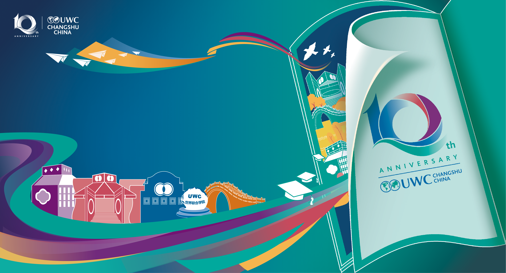

# UWCCSC Ceremony Interactive Message System

A real-time message display system for UWCCSC events. Participants submit messages via QR code, which are displayed on a central screen after ceremony commencement.

## Key Features
- QR Code scanning to message submission portal
- Central display page with manual message playback control
- Fallback message system when no submissions exist
- Customizable background image
- High-resolution QR code export capability
- Graceful failure handling for submissions

## Technical Details
**Dependencies**: Zero external dependencies - all required resources included  
**Database**: Requires MySQL/MariaDB for message storage  
**Server**: Needs PHP-enabled web server for operation  

## System Components
| File | Purpose |
|------|---------|
| `index.html` | Main display page with start button |
| `submit.html` | Participant message submission form |
| `planb.txt` | Preconfigured fallback messages |
| `qr_export.html` | QR code generator (max 4000×4000px) |
| `submit_fake.html` | Testing form (bypasses database) |

## Usage Instructions

### For Attendees
1. Scan ceremony QR code
2. Submit message through web form
3. Messages display after MC initiates playback

### For Administrators
**Start Playback:**
1. Open `index.html` on main screen
2. Click start button when ceremony begins

**Customization:**
- Replace `background.jpg` with same filename
- Edit `planb.txt` for fallback messages

**Testing:**
- Use `submit_fake.html` for system testing
- QR export via `qr_export.html`

## Deployment Requirements
1. Web server
2. MySQL/MariaDB database

## Development Notes
- Commit messages may not reflect actual changes
- Failed submissions redirect to success page
- Test thoroughly with fake submission form
- QR code dimensions configurable in export tool

## License
UWCCSC Internal Use Only - Not for Public Distribution

[Contact Technical Team] - [tech-support@uwccsc.edu]
