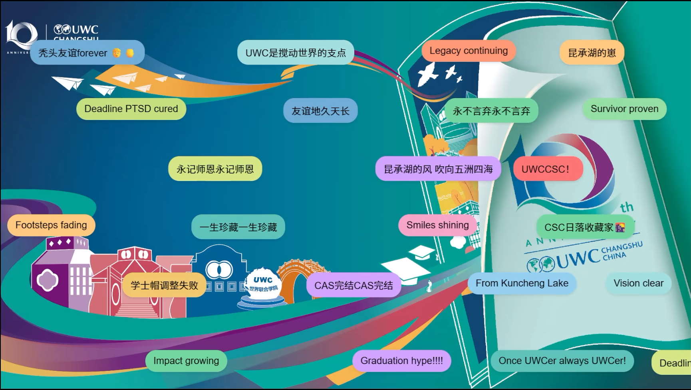

# UWCCSC 典礼留言展示系统

🌐 [English](README.md) | [简体中文](README.zh-CN.md)

一个用于典礼的实时留言展示系统。参与者通过扫描二维码提交留言，留言会实时显示在主屏幕上。系统包含备用留言与测试工具。

## 目录
- [功能介绍](#功能介绍)
- [环境要求](#环境要求)
- [部署方式](#部署方式)
- [个性化定制](#个性化定制)
- [测试工具](#测试工具)
- [常见问题](#常见问题)
- [贡献方式](#贡献方式)
- [许可协议](#许可协议)

## 功能介绍

### 核心功能
- **二维码访问**：参与者扫描二维码进入留言提交页面
- **留言队列系统**：
  - 通过 Start 按钮控制留言展示开始
  - 当无留言时自动回退至 `planb.txt` 中的备用留言
- **实时展示**：留言会即时显示在 `index.html` 页面上
- **高分辨率导出**：二维码生成器支持最高 4000×4000 像素导出

### 管理员功能
- 替换 `background.jpg` 自定义背景图
- 提供伪造提交页面（`submit_fake.html`）用于测试
- 异常处理机制：无论是否提交成功，用户总会看到成功页面

## 环境要求

### 开发环境
- 现代浏览器（推荐 Chrome 或 Firefox）
- 基础文本编辑器
- Git（可选）

### 生产环境
- Web 服务器（Apache 或 Nginx）
- MySQL 或 MariaDB 数据库

## 部署方式

- 配置 Web 服务器指向项目根目录
- 建立数据库
- 初始化留言表结构
- 在 `planb.txt` 中添加默认备用留言
- **注意**：数据库托管在中国大陆以外地区，因此在提交留言时需要**翻墙（突破中国大陆的网络防火墙）**

## 个性化定制

### 背景图像
- 替换 `/background.jpg` 文件，自定义背景（建议 16:9，分辨率 1920×1080 或更高）

### 备用留言
- 编辑 `planb.txt`，每行一条留言（建议不超过 140 个字符，UTF-8 编码）

## 测试工具

### 模拟提交
- 直接访问 `submit_fake.html` 可模拟提交成功，但不会写入真实数据库

### 二维码生成
- 打开 `qr_export.html` 页面可自定义参数：
  - 大小：100–4000 像素  
  - 导出格式：PNG

## 常见问题

### 留言未显示
- 确认数据库连接正常  
- 检查留言表结构是否正确  
- 确保点击了 Start 按钮

### 二维码异常
- 检查服务器是否可以从外部访问  
- 手动访问二维码链接测试

### 提交出错
- 查看 PHP 错误日志  
- 检查表单字段是否符合要求

## 贡献方式
- Fork 本项目  
- 创建功能分支：`git checkout -b feature/awesome-improvement`  
- 提交更改：`git commit -m "Add awesome improvement"`  
- 推送到远程仓库：`git push origin feature/awesome-improvement`  
- 提交 Pull Request 描述你的更改  

## 许可协议
本项目采用 MIT 许可协议。  
请参阅 [LICENSE](./LICENSE) 查看英文原文。  
简体中文版请参阅 [LICENSE.zh-CN.md](./LICENSE.zh-CN.md)。

## 特别授权声明

尽管本作品整体采用 [署名-非商业性使用 4.0 国际 (CC BY-NC 4.0)](https://creativecommons.org/licenses/by-nc/4.0/deed.zh) 协议发布，作者 Aidebug 特此授权：

**常熟世界联合学院（UWC Changshu China）**

在以下条件下进行本作品的商业性使用：

- **被授权方名称（Authorized Party）**: 常熟世界联合学院（UWC Changshu China）
- **授权用途（Permitted Use）**: 可将本作品用于商业或教学相关的活动与展示，包括不限于学校宣传、课程材料、公开演示等。
- **授权范围（Scope）**: 允许在不更改原始作品的基础上复制、展示、传播与发布本作品内容。
- **授权期限（Term）**: 永久授权（Permanent Authorization）
- **其他限制（Other Conditions）**: 
  - 须保留原作者署名（Aidebug）；
  - 不得向其他第三方转授权；
  - 本授权不代表对其他单位或个人开放商业使用权限。
